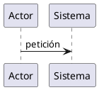

# El problema

::: {.callout-tip title="Proyecto"}

Este framework se desarrolla como un proyecto independiente.

**Repositorio GitHub**

<https://github.com/<organizacion>/quarto-extensions-framework>

**Documentación (GitHub Pages)**

<https://<organizacion>.github.io/quarto-extensions-framework>

:::

La documentación técnica moderna ya no está formada únicamente por texto.

Diagramas, modelos, arquitecturas, procesos y relaciones constituyen una parte esencial del conocimiento y deben evolucionar junto con el código fuente.

Quarto proporciona una plataforma excelente para generar documentación a partir de Markdown. Sin embargo, la integración de herramientas externas suele depender de procesos independientes, comandos manuales o soluciones específicas para cada proyecto.

La necesidad que dio origen a este framework apareció durante el desarrollo del libro **IASI**.

El número de diagramas comenzó a crecer rápidamente y mantener imágenes generadas manualmente dejó de ser una alternativa razonable. Cada modificación obligaba a regenerar archivos, comprobar versiones y actualizar recursos que, en realidad, deberían formar parte del propio proceso de construcción del libro.

El objetivo nunca fue simplemente generar diagramas.

El objetivo era que el autor pudiera escribir un bloque PlantUML dentro de un documento Quarto y olvidarse completamente del resto del proceso.

A partir de ese momento, el sistema debía asumir toda la responsabilidad:

- generar el diagrama;
- incorporarlo al documento;
- reutilizar resultados previamente generados;
- aplicar un estilo común;
- producir resultados reproducibles;
- integrarse de forma transparente con Quarto.

Desde el punto de vista del autor, escribir un diagrama debía resultar tan natural como escribir un bloque de código.

Pronto quedó claro que el problema era mayor de lo que parecía.

PlantUML era únicamente la primera herramienta que necesitábamos integrar. El mismo mecanismo podía resultar útil para otras tecnologías, otros formatos y otros compiladores.

La pregunta dejó de ser:

> ¿Cómo integramos PlantUML en Quarto?

y pasó a convertirse en otra mucho más interesante:

> ¿Cómo puede integrarse cualquier herramienta externa en Quarto de forma uniforme, reutilizable y mantenible?

Responder a esa pregunta supuso un cambio de perspectiva.

La implementación dejó de evolucionar como un filtro específico y comenzó a transformarse progresivamente en una infraestructura común para el desarrollo de extensiones.

Ese fue el verdadero origen del **Quarto Extensions Framework**.