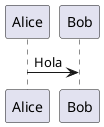

# Infraestructura

La extensión PlantUML delega la generación de diagramas en un servicio independiente desplegado mediante Docker.

Esta decisión separa con claridad dos responsabilidades:

- la extensión prepara el código PlantUML, aplica los estilos y gestiona la integración con Quarto;
- el servidor PlantUML recibe el código y devuelve la imagen generada.

```{.plantuml}
@startuml

rectangle "Proyecto Quarto" as Project
component "Extensión PlantUML" as Extension

node "Docker" {
  component "PlantUML Server" as Server
}

Project --> Extension : bloque PlantUML
Extension --> Server : POST /png
Server --> Extension : imagen PNG

@enduml
```

## ¿Por qué Docker?

PlantUML puede ejecutarse de distintas formas, por ejemplo mediante un archivo JAR local o a través de un servidor HTTP.

El framework utiliza un servidor desplegado mediante Docker por varios motivos:

- evita instalar PlantUML dentro de cada proyecto;
- centraliza la compilación en un servicio independiente;
- simplifica la actualización de versiones;
- permite reutilizar el mismo servidor desde distintos proyectos;
- mantiene desacoplados Quarto, PlantUML y el sistema operativo;
- facilita reproducir la infraestructura en otros equipos.

El contenedor no contiene recursos específicos del libro.

No conoce:

- `iasi.puml`;
- los capítulos;
- la caché;
- la configuración de Quarto;
- ni la estructura del proyecto.

Recibe un documento PlantUML completo y devuelve un recurso gráfico.

## Definición del servicio

El servicio se define mediante Docker Compose.

El archivo puede llamarse:

```text
compose.yml
```

Su contenido es:

```yaml
services:
  plantuml:
    image: plantuml/plantuml-server:jetty
    container_name: plantuml
    ports:
      - "1025:8080"
    restart: unless-stopped
```

La configuración publica el puerto `8080` del contenedor en el puerto `1025` de la máquina anfitriona.

El servicio queda disponible en:

```text
http://localhost:1025
```

Desde otro equipo de la red puede utilizarse el nombre o la dirección de la máquina anfitriona:

```text
http://javier:1025
```

## Estructura

Una organización mínima puede ser:

```text
infrastructure/
└── plantuml/
    └── compose.yml
```

El directorio no necesita volúmenes ni almacenamiento persistente.

Cada petición contiene todo el código necesario para generar el diagrama.

## Creación e inicio

Desde el directorio que contiene `compose.yml`:

```bash
docker compose up -d
```

La opción `-d` inicia el servicio en segundo plano.

Si la imagen todavía no existe localmente, Docker la descarga automáticamente.

## Estado

Para comprobar el estado del servicio:

```bash
docker compose ps
```

También puede comprobarse directamente con Docker:

```bash
docker ps
```

El contenedor debería aparecer con el nombre:

```text
plantuml
```

## Logs

Para consultar los logs:

```bash
docker compose logs plantuml
```

Para seguirlos en tiempo real:

```bash
docker compose logs -f plantuml
```

## Parada

Para detener el servicio sin eliminar el contenedor:

```bash
docker compose stop
```

Para volver a iniciarlo:

```bash
docker compose start
```

## Eliminación

Para detener y eliminar el contenedor:

```bash
docker compose down
```

La imagen descargada permanece en el sistema y podrá reutilizarse en el siguiente arranque.

## Reinicio

Para reiniciar el servicio:

```bash
docker compose restart
```

La opción:

```yaml
restart: unless-stopped
```

hace que Docker vuelva a iniciar el contenedor automáticamente después de reiniciar la máquina, salvo que haya sido detenido manualmente.

## Actualización

Para descargar una versión más reciente de la imagen:

```bash
docker compose pull
```

Después:

```bash
docker compose up -d
```

Docker recreará el contenedor utilizando la nueva imagen.

## Prueba desde el navegador

La página principal del servidor puede abrirse en:

```text
http://localhost:1025
```

o, desde otro equipo:

```text
http://javier:1025
```

Esta prueba confirma que el contenedor está iniciado y que el puerto se encuentra accesible.

## Prueba mediante POST

La extensión utiliza HTTP POST para enviar el código PlantUML.

Puede probarse manualmente con un archivo llamado `diagram.puml`:



Y ejecutar:

```bash
curl \
  --fail \
  --silent \
  --show-error \
  --request POST \
  --header "Content-Type: text/plain; charset=utf-8" \
  --data-binary "@diagram.puml" \
  http://localhost:1025/png \
  --output diagram.png
```

En Windows CMD:

```cmd
curl --fail --silent --show-error ^
  --request POST ^
  --header "Content-Type: text/plain; charset=utf-8" ^
  --data-binary "@diagram.puml" ^
  http://localhost:1025/png ^
  --output diagram.png
```

Si la operación termina correctamente, se generará:

```text
diagram.png
```

## Configuración de la extensión

Una vez iniciado el servicio, el proyecto Quarto debe indicar su dirección:

```yaml
filter-options:
  plantuml:
    server: http://javier:1025
```

La extensión añadirá automáticamente el formato solicitado:

```text
POST http://javier:1025/png
```

## Ausencia de persistencia

PlantUML Server no necesita guardar resultados.

La persistencia pertenece al framework y se gestiona mediante la caché local:

```text
.quarto/plantuml/
```

El contenedor puede destruirse y recrearse sin perder información del proyecto.

Esta separación mantiene la infraestructura simple, reemplazable y completamente ajena al contenido del libro.
